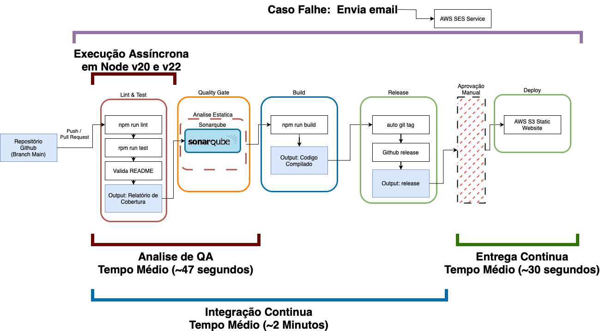

# 🚀 Desafio DevOps

---

## 🌐 Endereço do Servidor

[http://desafio-devops-1.s3-website-us-east-1.amazonaws.com](http://desafio-devops-1.s3-website-us-east-1.amazonaws.com)

---

## 🗺️ Diagrama

---

**Tarefa:**  
Crie um pipeline de CI/CD usando o **GitHub Actions** para um projeto simples de aplicação web.

---

## 📋 Requisitos

### 🔁 Gatilho

1. O pipeline deve ser ativado sempre que um novo commit for feito na branch `main`.

### 🧪 Etapas do Pipeline

2. O pipeline deve executar os seguintes passos:

   - ✅ Instalar as dependências do projeto  
   - 🧪 Executar testes unitários  
   - 🛠️ Construir a aplicação  
   - 📦 Armazenar o artefato como *release* do GitHub  
   - 🔐 Usar a funcionalidade **Environment** do GitHub para restringir a aprovação do deploy a um usuário ou grupo específico  

3. Se todos os passos acima forem bem-sucedidos, o pipeline deve:

   - 🚀 Fazer o **deploy** da aplicação em um **ambiente de teste**

4. Em caso de falha em qualquer etapa:

   - 📧 Notificar o desenvolvedor via **e-mail**

---

## 🌟 Plus (Não obrigatório, mas diferencial)

### 📐 Diagrama de Arquitetura

1. Criar um **desenho simples de arquitetura** na ferramenta [**draw.io**](https://draw.io) (*diagrams.net*) que mostre como será estruturado o pipeline.

   #### Critérios para o Diagrama:
   - Deve conter a **separação clara dos steps de CI e CD**
   - Qualquer **interação manual** deve estar explicitada

### 🛠️ GitHub Action Personalizada (TypeScript)

2. Criar uma action do tipo **TypeScript** que realize execução de algum **linter ou quality gate**.

   #### Exemplos:
   - 📄 Verificar a existência de arquivos necessários para o build  
   - 🔍 Executar análise estática com **SonarQube** ou ferramenta similar  
   - 🛑 Abortar a esteira se pré-requisitos não forem atendidos  

---

## 🧠 Critérios de Avaliação

1. **Correção**  
   O pipeline deve funcionar conforme os requisitos.

2. **Compreensão**  
   O candidato deve ser capaz de explicar o funcionamento e suas escolhas (avaliado em entrevista).

3. **Eficiência**  
   O pipeline deve evitar etapas desnecessárias.

4. **Boas Práticas**  
   - Uso adequado de **segredos** (`secrets`) para dados sensíveis  
   - Estrutura clara e reutilizável

5. **Entrega**  
   O **repositório do GitHub** com o pipeline implementado deve ser entregue dentro do prazo estipulado.

---
